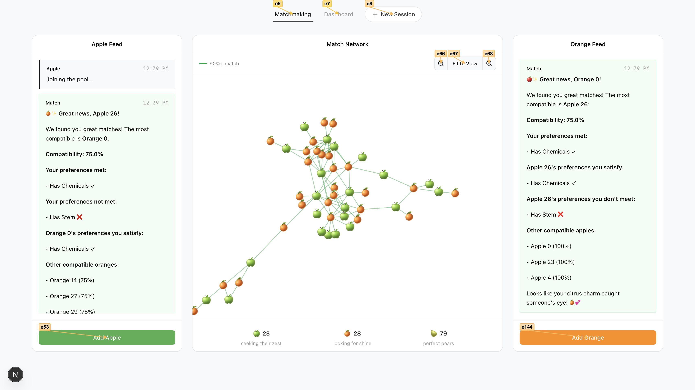
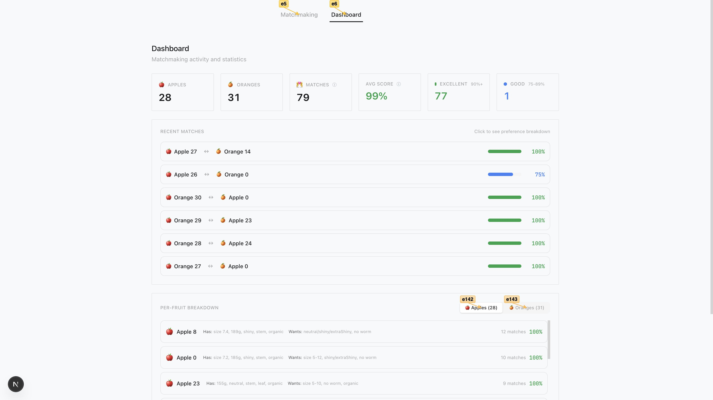

# Coding Challenge - Matchmaking System

## Architecture


## Screenshots

| Matchmaking | Dashboard |
|-------------|-----------|
|  |  |

## Introduction

Hey! Welcome to our little take home challenge. We won't force Leetcode problems down your throat. Instead, what we do here at Clera is build, so therefore, we expect you to build cool stuff too!

But what and why are we building? Well, a lot of the world revolves around matchmaking. The fact that you and I exist is proof of that. A not so insignificant portion of what shapes a person's life is determined by matchmaking: friends, love, jobs. I mean hell, what we're doing right now at this very moment is matchmaking. Despite its prevalence, it is still quite the difficult task. So let's tackle it together—on a small scale at least. Our goal is to connect apples to oranges. Just because we shouldn't compare apples to oranges, doesn't mean we can't try to create a perfect pear… pair.

## Problem Statement

The abstract idea of the project is simple. In one basket we have apples, each apple has preferences that it wishes its orange to fulfill. In another basket we have oranges, each orange obviously also has preferences that it wishes a potential apple to meet. Our job is to:

1. Match them based on their joint preferences
2. Communicate to both parties that we've found them a match

## Quick Start

```bash
pnpm install
cd frontend && pnpm install && cd ..
cp .env.example .env  # Fill in credentials
./scripts/setup.sh    # Seeds DB + creates initial matches
cd frontend && pnpm dev
```

Open http://localhost:3000

## What We Built

### Bidirectional Preference Matching

Score = (Apple's preferences met by Orange + Orange's preferences met by Apple) / 2

Each match stores which preferences were satisfied/violated in both directions, displayed in the UI with emoji-enhanced breakdowns.

### Matchmaking Page (`/matchmaking`)

Three-column layout:
- **Apple Feed** - Click "Add Apple" → generates fruit → streams LLM announcement → shows match result with compatibility breakdown
- **Match Network** - D3 force graph (react-force-graph-2d) of all fruits. Hover any node to see attributes, preferences, and best match with score
- **Orange Feed** - Same flow. When one side triggers a match, both sides get notified via Supabase Realtime

### Dashboard (`/dashboard`)

- Hero stats: Apple count, Orange count, Match count, Average score, Excellent (90%+), Good (75-89%)
- Recent matches table with compatibility scores
- Per-fruit breakdown showing each fruit's attributes and preferences as inline text

### Tech Stack

| Layer | Technology |
|-------|------------|
| Frontend | Next.js 16, React 19, Tailwind CSS |
| UI Components | shadcn/ui, Framer Motion |
| State | Zustand (persisted) |
| Graph | react-force-graph-2d, d3-force |
| Realtime | Supabase Realtime (broadcast) |
| Backend | Supabase Edge Functions (Deno) |
| Database | SurrealDB Cloud |
| LLM | Anthropic Claude (AI SDK) |

### How It Works

1. **Add Apple/Orange** → Edge function generates fruit with random attributes + relaxed preferences
2. **Store in SurrealDB** → Fruit record with name, attributes, preferences
3. **Find best match** → Query opposite fruits, calculate bidirectional preference satisfaction, rank by score
4. **Create RELATE edge** → Store match in graph with score breakdown
5. **LLM announcement** → Claude generates playful message showing which preferences matched/violated
6. **Realtime broadcast** → Both panels receive the match notification

## Hard Requirements

- The data must be loaded into and queried from SurrealDB ✅
- The communication between the system and the fruits need to be visualized in a medium of your choosing ✅
- You must communicate the matchmaking results through an LLM ✅

## File Structure

```
├── frontend/
│   ├── app/
│   │   ├── matchmaking/          # Main page with chat feeds + graph
│   │   ├── dashboard/            # Stats, recent matches, fruit breakdown
│   │   └── api/chat/             # API routes for LLM streaming
│   ├── components/
│   │   ├── chat/                 # AppleChat, OrangeChat
│   │   └── ui/                   # shadcn/ui components
│   └── lib/
│       ├── store.ts              # Zustand state
│       ├── supabase.ts           # Supabase client
│       └── useRealtimeMatches.ts # Realtime subscription hook
│
├── supabase/functions/
│   ├── _shared/
│   │   ├── generateFruit.ts      # Random fruit generation
│   │   ├── surreal.ts            # SurrealDB HTTP client
│   │   └── ai.ts                 # Anthropic client
│   ├── get-incoming-apple/       # Apple edge function
│   └── get-incoming-orange/      # Orange edge function
│
├── scripts/
│   ├── setup.sh                  # One-command setup
│   ├── seed-data.mjs             # Load 40 fruits into SurrealDB
│   └── batch-match.mjs           # Create matches above threshold
│
└── data/
    └── raw_apples_and_oranges.json
```
